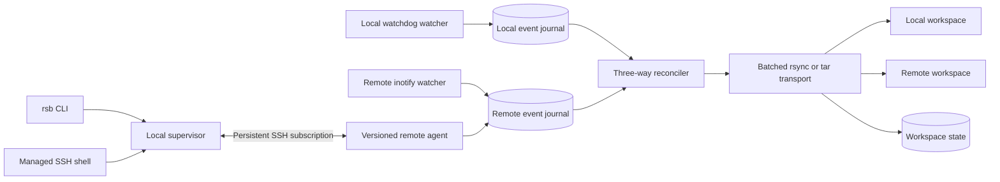

# Remote Sandbox Redesign

Date: 2026-07-10

Status: Approved for implementation planning

## 1. Context

`remote-sandbox` provides a local working copy, remote command execution, and bidirectional
file synchronization over SSH. The current implementation works for small trees but has
fundamental performance, lifecycle, and consistency problems.

The confirmed problems are:

- Local and remote control metadata is stored inside the synchronized working directories.
- Only the local side has an event watcher. Remote changes are discovered by periodic polling.
- Every sync constructs full manifests and hashes every regular file on both sides.
- Normal transfer opens one SSH operation per file.
- Initial binding performs one foreground sync and the daemon repeats it during startup.
- The daemon publishes its pid and control socket after startup sync, so a working process can
  appear as `stopped`.
- `rsb enter` intentionally exits the browsing shell after `rsb connect`, producing a visible
  disconnect and a second SSH shell.
- Symlinks are treated as unsupported entries. Common virtual-environment links can abort a
  complete sync.
- Concurrent changes, Git maintenance, and post-command sync can contend for locks or abort a
  whole cycle.
- The repository currently has no automated pytest suite.

The existing `remote-sandbox-redesign` worktree is not the basis for implementation. It has
useful ideas, but it still lacks a remote watcher and out-of-tree remote metadata. Its bulk tar
path writes files before validating that scanned inputs remain current, and its latest conflict
handling can silently skip paths while reporting an otherwise healthy daemon.

## 2. Goals

The redesign must:

1. Keep both working directories free of `.remote-sandbox` control data.
2. Make local and remote changes event-driven.
3. Start reporting progress within one second after binding confirmation.
4. Enter an interactive shell immediately without closing the original SSH session.
5. Display live sync state inside one dynamically redrawn prompt line.
6. Make initial transfer use a batched stream rather than per-file SSH operations.
7. Avoid hashing unchanged files during normal operation.
8. Preserve changes made while initial sync is running or while SSH is disconnected.
9. Propagate ordinary changes and deletions automatically without silently overwriting
   concurrent edits.
10. Separate remote command exit status from follow-up sync status.
11. Expose truthful lifecycle states, logs, progress, pending changes, and conflicts.
12. Provide automated unit, integration, E2E, performance, and security coverage.
13. Run as an isolated development tool named `rsb` until the redesign is accepted.

## 3. Non-goals

The first redesign will not:

- Merge arbitrary text conflicts automatically.
- Synchronize Git internal metadata.
- Synchronize virtual environments or dependency caches by default.
- Support binding two unrelated non-empty directories.
- Replace SSH authentication or store passwords.
- Automatically migrate development bindings into the existing production `rsb` namespace.
- Provide peer-to-peer synchronization without an SSH connection.

## 4. Development Isolation

The development build must coexist with the installed tool and must not read, modify, stop, or
clean any existing `rsb` state.

```text
Distribution name    remote-sandbox
Primary command      rsb
Long command         remote-sandbox
Local home           ~/.remote-sandbox/
Remote home          ~/.remote-sandbox/
Runtime directory    /tmp/remote-sandbox-<uid>/
SSH control path     /tmp/remote-sandbox-<uid>/cm/%C
```

The injected command inside `rsb enter` is `rsb connect`, never `rsb connect`.
Remote agents, ControlMaster sockets, daemon sockets, workspace identifiers, logs, and registries
all use the isolated namespace.

The working-tree configuration file remains `.rsbignore`. It is user content rather than control
metadata. Development bindings are not migrated when the command is later renamed to `rsb`.

## 5. Options Considered

### 5.1 Patch the current full-scan synchronizer

This option would move metadata, add progress, and make the remote poll more frequent. It is
rejected because a remote event would still trigger complete manifests and hashing, so large
trees would remain slow and repeated scans would continue to race with active tools.

### 5.2 Wrap an external two-way engine

Mutagen and Unison provide mature synchronization behavior. This option is not selected because
neither side currently has those tools, distribution would require platform-specific binaries,
and integration with placeholders, the existing shell protocol, workspace lifecycle, and custom
conflict semantics would become an additional compatibility layer.

### 5.3 Dual event journals with a purpose-built reconciler

This is the selected approach. A local daemon and a remote agent persist filesystem events,
reconcile only dirty paths, batch transfers through rsync or tar, and run periodic audits for
missed events. It preserves the current product model while replacing the slow synchronization
core.

## 6. High-level Architecture



The local supervisor owns synchronization decisions. The remote agent watches the remote tree,
persists events, serves path metadata, participates in transfer operations, and reports watcher
health. It does not make independent conflict decisions.

## 7. Metadata Layout

No control file is created below either workspace root.

### 7.1 Local

```text
~/.remote-sandbox/
  connections.toml
  agents/
  workspaces/<workspace-id>/
    workspace.toml
    state.sqlite3
    daemon.log
```

### 7.2 Remote

```text
~/.remote-sandbox/
  index.sqlite3
  agents/<agent-version>/agent.pyz
  workspaces/<workspace-id>/
    workspace.toml
    state.sqlite3
    watcher.log
```

The local `state.sqlite3` contains the synchronization base, local and last-observed remote
fingerprints, the local event journal, acknowledged remote sequence numbers, pending paths,
conflicts, lifecycle state, progress, and audit metadata. The remote `state.sqlite3` contains the
remote event journal, its acknowledgement watermark, watcher health, and remote audit metadata.
The remote journal remains authoritative until the local supervisor acknowledges its events.

Pids, Unix sockets, and temporary locks live in the runtime directory. Durable metadata is
created with user-only permissions. Shared agent versions are removed only when no workspace
references them.

The local registry maps a connection name, canonical local root, SSH target, canonical remote
root, and workspace ID. The remote index maps a canonical remote root to its workspace ID. This
replaces in-tree marker discovery. Commands invoked below a local workspace select the longest
matching registered root.

## 8. Component Boundaries

### 8.1 Identity and registry

Responsibilities:

- Generate and validate workspace IDs.
- Resolve local and remote roots to canonical paths.
- Read and update local and remote registries atomically.
- Reject conflicting bindings.
- Locate the current binding without an in-tree marker.

### 8.2 Journal

Responsibilities:

- Assign monotonically increasing event sequence numbers per replica.
- Persist create, modify, delete, move, overflow, and rescan-required events.
- Coalesce redundant path events without losing delete or rename meaning.
- Track the highest sequence acknowledged by the reconciler.
- Replay unacknowledged events after restart or reconnect.

An event is acknowledged only after the resulting state transaction commits.

### 8.3 Remote agent

Responsibilities:

- Run on remote Python 3.10 or later as a self-contained versioned zipapp.
- Use Linux inotify through Python and `ctypes` without pip or a virtual environment.
- Add watches for newly created directories.
- Detect inotify queue overflow and record `rescan-required`.
- Fall back to low-frequency polling on unsupported operating systems.
- Persist events while SSH is unavailable.
- Stream journal events from a requested sequence number.
- Return batched path metadata without following symlinks.

The agent listens on no network port. It is invoked through authenticated SSH and only operates on
registered workspace roots.

### 8.4 Reconciler

Responsibilities:

- Compare base, local, and remote state for dirty paths.
- Request strong hashes only when quick fingerprints are insufficient.
- Produce an immutable action plan.
- Classify conflicts without executing transfers.
- Requeue paths changed while an action is being prepared or executed.

### 8.5 Transport

Responsibilities:

- Transfer selected paths through one rsync session per direction when available.
- Fall back to a validated tar stream when rsync is unavailable.
- Apply deletions in safe child-before-parent order.
- Use temporary files and atomic rename for regular-file writes.
- Preserve symlink target text without dereferencing it.
- Verify expected source and destination fingerprints before committing base state.

### 8.6 Supervisor

Responsibilities:

- Publish lifecycle state before slow work begins.
- Start and stop local and remote watchers.
- Maintain the persistent SSH event subscription.
- Debounce work and serialize reconciliation transactions.
- Retry transient failures with bounded exponential backoff.
- Keep local and remote journals available during disconnection.
- Update progress and shell-visible status.

### 8.7 Shell integration

Responsibilities:

- Keep `rsb enter` and the connected workspace in one SSH PTY.
- Handle binding requests through authenticated terminal control markers.
- Render a fixed-width status slot in the Bash prompt.
- Redraw the current Readline input line when progress changes.
- Preserve the user's input buffer and cursor during redraw.
- Stop prompt injection while a foreground command controls the terminal.

### 8.8 CLI

Responsibilities:

- Parse arguments and render concise user-facing output.
- Never expose a traceback unless `--debug` is enabled.
- Keep remote command exit status independent from sync follow-up status.
- Offer explicit status, conflict resolution, reconnection, and cleanup operations.

## 9. Binding and Initial Sync

New binding continues to require at least one empty side. Two unrelated non-empty trees are
rejected before control metadata is committed.

The sequence is:

1. Establish or reuse an interactive SSH ControlMaster.
2. Canonicalize and validate both workspace paths.
3. Confirm the intended binding and initial direction.
4. Allocate a workspace ID and create local and remote out-of-tree metadata.
5. Start both watchers and record their starting sequence numbers.
6. Publish local daemon state as `initial-syncing`.
7. Scan entry type, size, high-resolution time, and symlink target without hashing every file.
8. Create the initial directional transfer plan.
9. Transfer selected entries through one rsync stream, or a tar stream fallback.
10. Replay and reconcile all events recorded since the starting sequence numbers.
11. Repeat event reconciliation until both journals reach a short quiet window.
12. Commit the synchronized base and transition to `ready`.

Initial transfer must not use a second daemon startup sync. The supervisor is the only owner of
the initial synchronization transaction.

Changes made during the bulk copy are not folded into an unstable snapshot. They remain journal
events and are reconciled after the bulk phase. If both replicas change the same path differently,
the path becomes a conflict rather than being overwritten.

## 10. Immediate Shell and Dynamic Prompt

Both initial directions enter a shell immediately.

- If the remote tree is already the complete source, the shell starts in the remote workspace.
- If the remote tree is an incomplete destination, the shell starts in remote `$HOME`, exports the
  workspace path, and automatically changes to the workspace after initial sync becomes ready only
  if the user has remained in that initial holding directory.
- The user may manually enter the incomplete remote workspace, but the prompt continues to show
  its sync state and concurrent modifications are handled by the journal and conflict rules.

Example development prompt:

```text
[dev-server:dq sync 40%] user@server:~ % python tra
```

The bracketed status is one live prompt field. It does not print historical progress lines.

Prompt states include:

```text
[dev-server:dq scanning]
[dev-server:dq planning]
[dev-server:dq sync 40%]
[dev-server:dq conflict 1]
[dev-server:dq offline]
[dev-server:dq]
```

The remote prompt contains a fixed-width sentinel. The local PTY output parser replaces that
sentinel with an equal-width, space-padded status field. While Bash Readline is waiting for input,
progress changes trigger a private Readline redraw binding. Readline redraws the prompt, the
current input buffer, and the cursor, so an input such as `python tra` remains intact while the
percentage changes. Once a new normal prompt begins in `ready`, it may switch to the compact label.
Refresh is capped at three or four updates per second.

The supervisor knows whether the shell is at a prompt through authenticated control markers. It
does not inject redraw input while `top`, `vim`, or another foreground command is running. The next
prompt immediately displays the newest state.

Inside the browsing shell, `rsb connect` sends a binding request and waits for a local
response instead of calling `exit`. On success, the same remote shell switches from `enter` mode
to managed-workspace mode. On cancellation or binding failure, it remains in browsing mode and
shows a concise error without closing SSH.

## 11. Ongoing Incremental Synchronization

The normal cycle is:

1. A watcher persists an event.
2. The supervisor receives or discovers the new sequence number.
3. Events are debounced and coalesced by path.
4. The reconciler requests batched metadata for dirty paths and required parents.
5. Quick fingerprints are compared with base state.
6. Strong hashes are computed only for changed or ambiguous regular files.
7. Same-direction actions are grouped into one transport session.
8. Expected source and destination fingerprints are rechecked.
9. Transfer and base updates commit as one logical transaction.
10. Consumed event sequences are acknowledged.

Watcher events produced by synchronization itself are not blindly discarded. The supervisor
records the expected result fingerprint. A matching event is acknowledged as an echo. A different
result is treated as a real concurrent change.

A full metadata audit runs after watcher overflow, reconnect, process recovery, and at a long idle
interval. The audit scans metadata first and hashes only ambiguous candidates. A normal no-op
cycle must not read every file's contents.

## 12. Synchronization Semantics

### 12.1 Ordinary changes

- Only local changed from base: push local to remote.
- Only remote changed from base: pull remote to local.
- Only local deleted from base: delete remote.
- Only remote deleted from base: delete local.
- Both replicas independently reached the same content: update base without conflict.

### 12.2 Concurrent modification during transfer

If an expected fingerprint changes before an action commits, that action does not update base. The
path is requeued. Repeatedly busy paths move the workspace to `degraded` with a visible reason but
do not stop unrelated paths.

### 12.3 Conflicts

The following are conflicts:

- Both replicas changed the same path to different content.
- One replica deleted a path while the other modified it.
- File, directory, and symlink kinds diverged.
- An edited or deleted placeholder no longer represents its remote source.

Conflict handling is non-destructive:

- Neither workspace copy is overwritten.
- Both versions and metadata are copied into the external conflict store.
- The base entry remains unresolved.
- Other paths continue syncing.
- Workspace state becomes `degraded` and exposes a conflict count.

Resolution commands are:

```bash
rsb conflicts
rsb resolve <path> --use-local
rsb resolve <path> --use-remote
```

Clock-based last-writer-wins behavior is explicitly rejected.

### 12.4 Symlinks and special files

Symlinks are first-class entries. Their target text is preserved without following the target.
Relative and absolute links are allowed, including broken links. The synchronizer never copies
content from outside a workspace through a symlink.

Sockets, FIFOs, device nodes, and other special entries are not transferred. They produce a
warning and degraded detail when relevant, but they do not abort unrelated paths.

### 12.5 Placeholders

The existing large remote-file placeholder behavior remains. A placeholder is recognized from
validated metadata and is not uploaded as ordinary content. Deleting or editing a local
placeholder does not automatically delete or replace the remote large file. It creates a
resolvable conflict.

## 13. Ignore Policy

Built-in ignores apply even when `.rsbignore` does not exist:

```text
.git/
.venv/
venv/
__pycache__/
.pytest_cache/
.mypy_cache/
.ruff_cache/
.tox/
.nox/
node_modules/
.DS_Store
common editor swap and temporary files
```

Git operations are local-only. `.git` is not synchronized. The remote working tree receives
normal project files and may not be treated as an independently managed Git repository.

`rsb init` writes an explanatory default `.rsbignore` that users may extend. `.git/`, hard
control metadata, and path-safety rules cannot be re-enabled through `.rsbignore`. Environment and
cache defaults may be explicitly overridden when a user accepts their portability cost.

Control characters in relative paths are rejected with an explicit warning because the portable
rsync file-list fallback cannot represent them safely. Spaces and Unicode names remain supported.

## 14. Lifecycle and Status

The durable workspace states are:

```text
starting
initial-syncing
ready
syncing
degraded
disconnected
failed
stopped
```

`Connected <name>` is a binding event rather than a durable state.

The pid and `starting` status are published before agent startup, scanning, hashing, or transfer.
`rsb status` reads durable status and verifies process liveness, so a running startup process
is never reported as `stopped`.

Example status output:

```text
NAME  STATE            PROGRESS       PENDING  CONFLICTS  LAST_SYNC
dq    initial-syncing  421/3626 40%   18       0          2s
```

`rsb status <name> --watch` redraws this status in place.

### 14.1 Disconnection

- The local and remote journals continue recording their respective local events.
- Key-based SSH reconnects automatically with bounded exponential backoff.
- Password-based SSH that cannot authenticate in the background becomes `disconnected`.
- `rsb reconnect <name>` prompts in the foreground and resumes from acknowledged journal
  sequences.
- Every reconnect performs a metadata audit before returning to normal incremental mode.

### 14.2 Start and stop

`rsb start` starts both watchers, replays journals, and audits current state. It does not
repeat a completed initial sync.

`rsb stop` stops both the local daemon and remote watcher. A later start audits both trees
because changes made while stopped were not journaled.

### 14.3 Failures and logging

Transient failures become `degraded` or `disconnected` and remain retryable. Fatal process or
state corruption becomes `failed`. User-facing commands print one actionable error line and the
relevant log path. Tracebacks are enabled only by `--debug`.

Logs use size-based rotation and bounded retention.

## 15. Command Semantics

The development command set includes:

```text
rsb init
rsb enter
rsb connect
rsb reconnect
rsb status [name] [--watch]
rsb start [name]
rsb stop [name]
rsb shell [name]
rsb run [name] -- <command>
rsb conflicts [name]
rsb resolve <path> --use-local|--use-remote
rsb fetch
rsb peek
rsb forget <name> [--local-only]
```

`rsb run` always returns the remote command's exit code. Follow-up synchronization is a
separate best-effort wait. A sync failure produces a warning and daemon retry but never replaces
the command result or emits an uncaught traceback.

## 16. Forget and Cleanup

`rsb forget <name>` performs double-ended cleanup:

1. Stop the local supervisor.
2. Stop the remote watcher.
3. Delete the remote workspace metadata.
4. Remove unused remote agent versions when safe.
5. Delete local workspace metadata.
6. Delete the local registry record.

No project file is deleted.

If the remote side cannot be reached, normal `forget` keeps the local binding so cleanup can be
retried. `--local-only` explicitly abandons remote state, removes local metadata and registry, and
prints the exact remote metadata location that may remain.

## 17. Security Requirements

- All remote actions use OpenSSH authentication and configured host policy.
- No password, private key, or authentication token is stored by the tool.
- Workspace IDs, connection names, targets, and paths are validated before use.
- Remote path operations use structured arguments or length-delimited data, not interpolated shell
  fragments.
- All resolved transfer destinations must remain below the registered workspace root.
- Tar entries and file lists are validated against traversal, absolute paths, and control
  characters before extraction.
- Symlinks are never followed for traversal or transfer.
- The remote agent operates only on roots registered in its protected index.
- Control markers use an unpredictable session nonce and are not accepted from ordinary command
  output without matching the active session protocol.
- Metadata directories and control sockets are user-only.

## 18. Failure Modes

| Failure | Required behavior |
| --- | --- |
| SSH network loss | Enter `disconnected`, preserve both journals, retry when possible |
| Password master expires | Require foreground reconnect without losing queued events |
| Local daemon crash | Detect dead pid, restart, replay local and remote sequences |
| Remote watcher crash | Enter `degraded`, restart agent, perform remote audit |
| Inotify overflow | Record `rescan-required`, run full metadata audit |
| File changes during transfer | Abort that path's base update and requeue it |
| Conflict | Preserve both versions, continue unrelated paths, show conflict count |
| State database corruption | Enter `failed`, preserve database, require explicit repair or rebind |
| rsync unavailable | Use validated tar fallback |
| Both transfer engines fail | Remain degraded and retry without claiming ready |
| Log or metadata disk full | Stop committing acknowledgements, report failure, do not lose source data |
| Remote cleanup unavailable | Keep binding unless `--local-only` is explicit |

## 19. Test Strategy

Production changes follow test-driven development. Each behavior begins with an observed failing
test, followed by the smallest passing implementation and refactoring with the suite green.

### 19.1 Unit tests

Unit coverage includes:

- Three-way reconciliation for create, modify, delete, same-content, and kind changes.
- Delete-versus-modify and simultaneous modification conflicts.
- Journal sequencing, acknowledgement, coalescing, rename, duplicate event, and overflow behavior.
- Lifecycle transitions and stale pid or status handling.
- Symlink fingerprints, broken links, ignored paths, special files, and placeholders.
- Path containment, traversal rejection, control characters, and shell argument handling.
- Progress calculation and status formatting.
- Fixed-width prompt substitution and Readline redraw behavior.
- Command exit status separation from sync failures.

External SSH and filesystem dependencies are mocked in unit tests. Assertions target observable
plans, state, and output rather than private method calls.

### 19.2 Integration tests

Integration tests use two temporary replicas with real SQLite, watchdog, subprocesses, rsync, and
tar where available.

Scenarios include:

- Initial local-to-remote and remote-to-local sync.
- Both sides initially empty.
- Changes added, modified, renamed, and deleted during initial transfer.
- Large sets of small files transferred in batches.
- Changes during incremental transfer.
- Conflict creation, persistence, listing, and both resolution directions.
- Daemon termination during state update and replay after restart.
- Journal replay without missing or duplicating committed work.
- Fallback from rsync to tar.
- Placeholder fetch and protection.
- Forget cleanup ordering and remote-unavailable behavior.

### 19.3 E2E tests

E2E uses an isolated Linux SSH container with Python 3.10, rsync, tar, and both password and key
authentication fixtures. Automated tests never depend on dev-server.

Critical flows include:

- `rsb enter`, remote browsing, and same-session `rsb connect`.
- Binding failure or cancellation without closing the browsing shell.
- Dynamic prompt percentage changes while a partial command remains intact.
- No prompt injection during `top`, `vim`, or another foreground program.
- Remote deletion appearing locally through the event subscription.
- Network interruption, key reconnect, password re-authentication, and sequence replay.
- Start, stop, reconnect, conflict resolution, and double-ended forget.
- Verification that neither workspace contains `.remote-sandbox` or control metadata.
- Verification that the development command does not read or modify the production namespace.

After all automated gates pass, a separate manual acceptance run is performed against dev-server.

### 19.4 Performance tests

CI smoke benchmarks use at least 5,000 small files. Extended local benchmarks use larger trees and
mixed file sizes.

The measured properties are:

- Time to first visible phase or progress update.
- Initial transfer throughput compared with direct rsync.
- p50 and p95 event-to-replica latency for small files and deletes.
- No-op CPU and disk-read activity.
- Hash count for unchanged trees.
- Memory and journal growth during an event burst.
- Recovery time after reconnect and overflow audit.

### 19.5 Security tests

Security coverage includes:

- `..`, absolute, control-character, leading-dash, Unicode, and long paths.
- Malicious tar entries and remote manifests.
- Symlink escape attempts and links changed between validation and transfer.
- Shell metacharacters in targets, roots, connection names, and filenames.
- Forged terminal control markers with incorrect nonces.
- Workspace ID and remote-index mismatch.
- Attempts to delete or overwrite files outside registered roots.
- Metadata permission checks.

## 20. Quality Gates and Acceptance Criteria

The redesign is not complete until:

- `pytest`, `ruff`, and strict `mypy` all pass.
- Overall statement coverage is at least 85 percent.
- Reconciler, journal, and path-safety branches have complete targeted coverage.
- Binding confirmation is followed by a visible phase or progress update within one second.
- A small file change or deletion reaches the other replica with a LAN p95 target of two seconds.
- A no-op cycle does not read and hash every unchanged file.
- Initial bulk transfer approaches direct rsync throughput and never falls back to per-file SSH for
  ordinary batches.
- A daemon doing initial sync is reported as `initial-syncing`, never `stopped`.
- A remote command's exit status is unchanged by follow-up sync failure.
- Disconnect and restart tests show no lost acknowledged or unacknowledged changes.
- Conflicts never silently overwrite either version.
- Existing `rsb` commands, processes, sockets, and metadata remain untouched throughout
  development testing.

## 21. Implementation Sequencing Constraints

The implementation plan must preserve testable boundaries and should be divided into stages that
leave the repository in a working state. The sequence must begin with the isolated `rsb`
namespace and a test harness, then establish identity and durable state, remote journaling,
incremental reconciliation, transport, lifecycle, shell integration, and finally real-host
acceptance.

No phase may claim readiness based only on process existence. No bulk optimization may bypass
fingerprint validation or base-state transaction rules. No conflict may be converted into a silent
skip.

## 22. Architecture Decisions

### ADR-001: Use dual persistent event journals

Status: Accepted

Decision: Use a local watchdog watcher and a remote inotify agent. Persist events on both sides and
reconcile from acknowledged sequence numbers.

Consequence: The system gains fast remote response and disconnect recovery at the cost of a
versioned remote agent and journal lifecycle management.

### ADR-002: Store all control metadata outside workspaces

Status: Accepted

Decision: Use user-home workspace directories and local and remote registries. Do not create an
in-tree marker.

Consequence: Workspaces remain clean. Current-binding lookup depends on the registry and canonical
path matching.

### ADR-003: Use rsync as the primary batch transport

Status: Accepted

Decision: Use capability-negotiated rsync for selected paths and validated tar streaming as a
fallback.

Consequence: Initial and burst transfers avoid per-file SSH overhead without delegating conflict
semantics to rsync.

### ADR-004: Keep one interactive SSH shell

Status: Accepted

Decision: Convert the browsing shell into the managed workspace shell through a bidirectional PTY
protocol. Do not exit and reconnect after `connect`.

Consequence: The shell UX is continuous. The PTY protocol and prompt renderer require dedicated
integration and E2E tests.

### ADR-005: Preserve conflicts instead of choosing a winner

Status: Accepted

Decision: Store both versions externally, leave both workspace copies untouched, continue unrelated
paths, and require explicit resolution.

Consequence: Data is protected, but users must resolve genuine concurrent edits.

### ADR-006: Ignore Git metadata

Status: Accepted

Decision: `.git/` is a built-in ignore. Git operations are local-only.

Consequence: Git maintenance cannot corrupt the sync state. The remote tree is a compute replica,
not an independently managed Git repository.

### ADR-007: Isolate the redesign as `rsb`

Status: Accepted

Decision: Use separate command, distribution, metadata, runtime, SSH control, and remote-agent
namespaces throughout development.

Consequence: The redesign can be tested without interfering with the installed tool. Development
bindings are disposable and are not automatically migrated.
